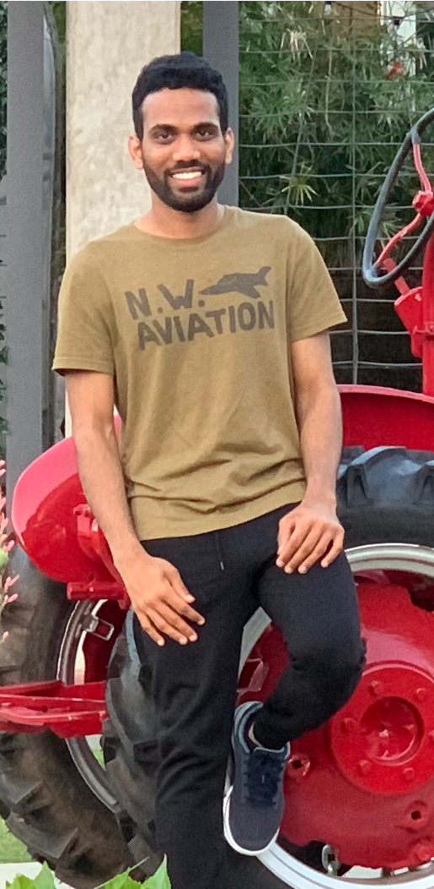

## About

I'm a third year Computer Science PhD student at 
<a href="https://ucsd.edu/" target="_blank">UC San Diego</a> where I'm advised by 
<a href="http://cseweb.ucsd.edu/~snoeren/" target="_blank">Alex Snoeren</a>. 
I'm also a member of 
<a href="https://www.sysnet.ucsd.edu/sysnet/" target="_blank">Systems and Networking</a> and 
<a href="https://circuit-switching.sysnet.ucsd.edu/" target="_blank">Circuit Switching</a> 
research groups. My research interests broadly lie in distributed systems and (high performance) networking.
My current research focuses on accelerating (networking) applications using SmartNICs.

## Past
I received my bachelors degree from 
<a href="http://www.iitkgp.ac.in/" target="_blank">Indian Institute of Technology Kharagpur</a> in 2014. 
I spent the next four years working at Microsoft as a Software Engineer in Azure SQL Database team, 
building services that support 
*<a href="https://azure.microsoft.com/en-us/services/sql-database/" style="color:black" target="_blank">SQL databases</a>* and 
*<a href="https://azure.microsoft.com/en-us/services/virtual-machines/sql-server/" style="color:black" target="_blank">SQL Server VMs</a>*
 on Microsoft Azure.

## Publications
**SmartNIC Performance Isolation with FairNIC**  [ 
    <a href="https://drive.google.com/file/d/10zDm_APvfSGLj82uYTx5GUw0-uyAUdlD/view?usp=sharing" target="_blank">paper</a> | 
    <a href="https://drive.google.com/file/d/1V2SKr-x8UKUuxayEWbPdi4NpYc5FKlBt/view?usp=sharing" target="_blank">talk</a> |
    code 
]    
Stewart Grant**\***, <ins>Anil Yelam</ins>**\***, Maxwell Bland and Alex C. Snoeren  
*<a href="https://conferences.sigcomm.org/sigcomm/2020/" style="color:black" target="_blank">SIGCOMM '20</a>*  
**(\* Co-first authors)**

**CoResident Evil: Covert Communication In The Cloud With Lambdas**  [ 
    <a href="https://drive.google.com/file/d/1KXOCJANqL7p2QLynmVQ_5KusumrUdnHR/view?usp=sharing" target="_blank">paper</a> | 
    talk |
    <a href="https://github.com/anilkyelam/columbus" target="_blank">code</a>
]    
<ins>Anil Yelam</ins>, Shibani Subbareddy, Keerthana Ganesan, Stefan Savage and Ariana Mirian  
*<a href="https://www2021.thewebconf.org/" style="color:black" target="_blank">The Web Conference '21</a>* (To appear)
  
 

[//]: ## Projects
[//]: TBA

## CV
Resume: 
<a href="./Resume_Short.pdf" target="_blank">Short</a>, Long.

## Contact
**Email:** ayelam(AT)ucsd(DOT)edu  
**Office:** 
<a href="http://act.ucsd.edu/maps/?lat=32.88186000000002&lng=-117.23361000000001&t=roadmap&z=19&p=&r=100&v=3&wid=440&q=ebu3b&qr=100" target="_blank">CSE 3140</a>  
**Other:**
<a href="https://www.linkedin.com/in/anilkumaryelam/" target="_blank">LinkedIn</a>, 
<a href="https://www.github.com/anilkyelam/" target="_blank">GitHub</a>, 
<a href="https://www.goodreads.com/user/show/33495932-anil-kumar" target="_blank">Goodreads</a>

## On a personal note

I grew up in a [small village](https://goo.gl/maps/EgKhvufCn252) in Southern India where I went to primary school. Since then, I've moved around quite a bit, both in and outside India, starting from Guntur (2006-08), 
Hyderabad (2008-10), Kharagpur (Undergrad, 2010-14), Belgrade (Microsoft Serbia, 2014-16), Seattle (Microsoft Redmond, 2016-18) and San Diego (UC San Diego, 2018-present).
I'm an avid reader and I like literary fiction - [García Márquez](https://en.wikipedia.org/wiki/Gabriel_Garc%C3%ADa_M%C3%A1rquez) is my favorite. Sports-wise, I love playing Tennis.
